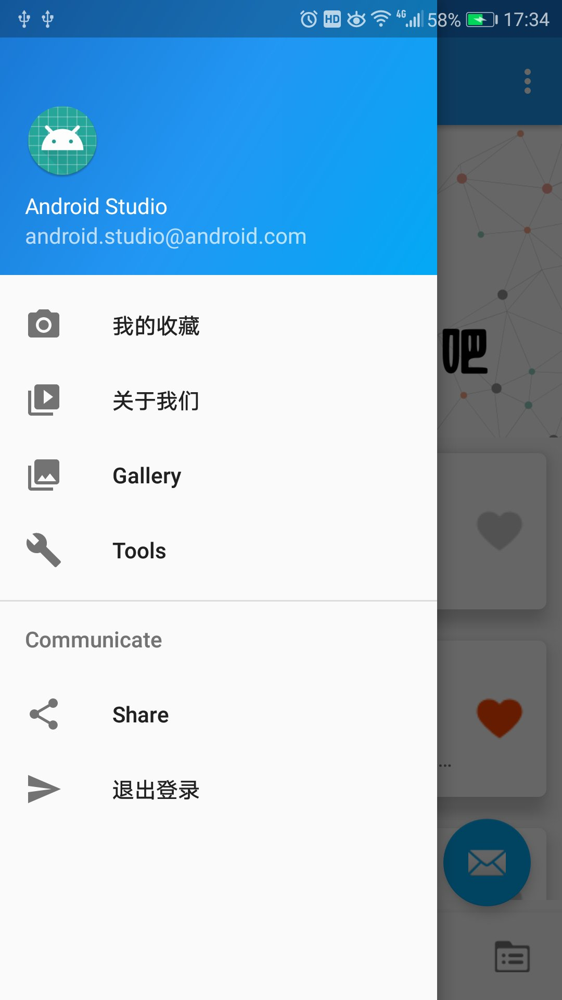
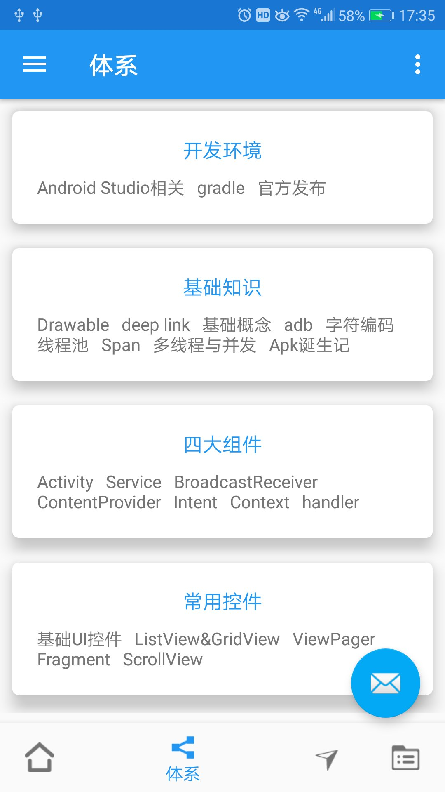
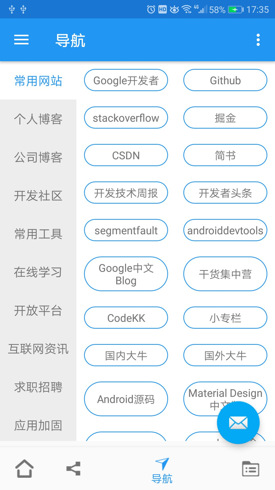
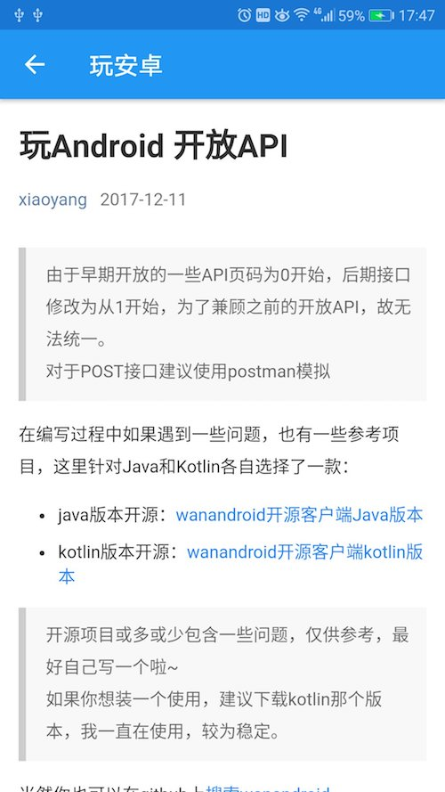

# WanAndroidClient
玩安卓客户端


<br>

# MaterialDesign + Retrofit + RxJava + MVP

# 接口
* [玩Android 开放API](http://www.wanandroid.com/blog/show/2)

# APK


# 截图
 
 
 
 

# TODO
* 功能完善，代码结构优化
* 界面美化，加动画效果
* 从产品角度进一步优化
* 现阶段很糙，慢慢打磨

# 感谢开源
* [YUtils](https://github.com/yechaoa/YUtils)
* [RxJava](https://github.com/ReactiveX/RxJava)
* [Retrofit](https://github.com/square/retrofit)
* [RxAndroid](https://github.com/ReactiveX/RxAndroid)
* [OkHttp](https://github.com/square/okhttp)
* [Glide](https://github.com/bumptech/glide)
* [ButterKnife](https://github.com/JakeWharton/butterknife)
* [Banner](https://github.com/youth5201314/banner)
* [VerticalTabLayout](https://github.com/qstumn/VerticalTabLayout)
* [AgentWeb](https://github.com/Justson/AgentWeb)
* [BRVAH](https://github.com/CymChad/BaseRecyclerViewAdapterHelper)


# 参考
* [todoapp](https://github.com/googlesamples/android-architecture/tree/todo-mvp/todoapp)
* [Awesome-WanAndroid](https://github.com/JsonChao/Awesome-WanAndroid)


<br>


```
   Copyright 2018 yechaoa

   Licensed under the Apache License, Version 2.0 (the "License");
   you may not use this file except in compliance with the License.
   You may obtain a copy of the License at

       http://www.apache.org/licenses/LICENSE-2.0

   Unless required by applicable law or agreed to in writing, software
   distributed under the License is distributed on an "AS IS" BASIS,
   WITHOUT WARRANTIES OR CONDITIONS OF ANY KIND, either express or implied.
   See the License for the specific language governing permissions and
   limitations under the License.
```
